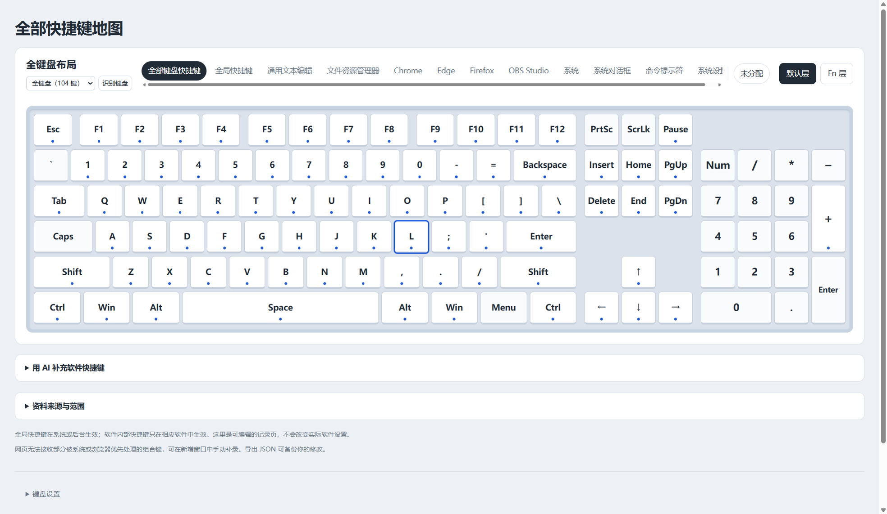

# 快捷键地图

Windows 离线快捷键参考工具。键盘图可按全局或软件查看已记录和未分配的组合键；点击按键可添加、编辑记录。修改保存在当前使用环境的本地数据中，也可导出、导入备份。它不会修改系统、软件或键盘驱动的设置，也不会在启动时扫描本机快捷键。

从 [GitHub Releases](https://github.com/Marcell-Lee/shortcut-map-windows/releases/latest) 下载 Windows 安装版或免安装版。当前版本为 1.0.3；程序尚未使用代码签名证书。

## Windows 桌面版

GitHub 发布页的 `ShortcutMap-Setup-v1.0.3.exe` 是安装版，`ShortcutMap-Portable-v1.0.3.exe` 是免安装版。打开后可在 68 键和标准 104 键布局间切换；两套键位映射分别保存，快捷键记录共用。点击“识别键盘”时，应用只读取 Windows 报告的键盘设备名称并尝试推荐布局。设备名称不明确时会请用户手动选择一次，不会按通用 HID 名称或设备编号猜测。首次打开不会自动检测，也不会读取各软件的自定义快捷键。



桌面版与浏览器 HTML 使用不同的本地存储位置。要把原有个人记录带进桌面版，请先在原页面“导出备份”，再在桌面版“导入备份”。分发包只含公开默认资料，不含 `local/` 中的个人资料。

## 直接使用

运行 `npm run pack` 后，将 `release/快捷键地图-便携版.zip` 发给其他人。解压并双击其中的 HTML 即可使用。分发版只含公开的默认快捷键和一套 68 键示例布局；使用者可通过页面导入自己的记录。`docs/使用说明.txt` 会一同放入压缩包。

## 开发与数据边界

### 用 AI 直接补充软件快捷键

Windows 桌面版展开“用 AI 补充软件快捷键”并复制提示词，交给支持本机文件读写的编程 Agent。可使用 Codex、Claude Code、Cursor、GitHub Copilot 的本地 Agent 模式、Gemini CLI、Windsurf、Cline、Roo Code、OpenCode、TRAE 等；普通聊天网页或远程沙箱不能直接访问用户电脑。能力说明可参考 [Cursor Agent](https://cursor.com/docs/agent/overview)、[GitHub Copilot Agent](https://docs.github.com/en/copilot/how-tos/copilot-in-your-ide/use-copilot-agents/use-agent-mode)。

应用在自身用户数据目录下准备 `agent-workspace/`，提示词自动填入绝对路径，不依赖开发者机器路径。目录中包含 `AGENTS.md` 更改规范、`shortcut.schema.json` 字段定义、`example.json` 格式示例及独立 `validate.cjs` 校验器。Agent 必须先列出软件让用户选择，再只读收集所选软件的当前自定义方案或官方 Windows 默认资料；备份后直接写入 `software-shortcuts.json`，无需手动复制 JSON。

文件使用 `{version:1, selectedApps:[软件名], apps:[{name,shortcuts:[{combo,action,scope,source,note}]}]}`。`selectedApps` 限定本次合并范围，不是删除列表。应用每两秒检查文件，完整校验通过后才合并；保留手动记录、未选软件和 Windows 系统默认资料，不因缺少条目而删除旧记录。后台软件快捷键可用 `scope:global`，软件内部使用 `scope:app`。

导入前完整状态备份在本地存储的 `<storageKey>-before-agent`，仅保留上一次导入前的状态；Agent 还应在目录的 `backups/` 保留文件备份。格式错误、超过限制或存储失败时不导入。`import-status.json` 记录文件 SHA-256、`applied/rejected` 与说明，供 Agent 确认结果；关闭应用时不会加载。用户软件资料仅保存在本机，不进入安装包或公开仓库。原手动 JSON 导入保留为备用入口。

| 位置 | 内容 | 是否进入便携版 |
| --- | --- | --- |
| `src/` | 页面、样式和交互 | 是，内联到 HTML |
| `data/layout.json` | 通用 68 键示例布局 | 是 |
| `data/layout-full.json` | 标准 104 键布局 | 是，内联到 HTML |
| `data/shortcuts.json` | 公开默认快捷键及资料来源 | 是 |
| `local/profile.json` | 当前电脑的键盘映射及个人记录 | 否 |
| `local/research/` | 从本机提取的历史资料 | 否 |
| `research/tables-*.json` | 资料整理用的公开来源表格 | 否 |
| `dist/` | 本地开发页面 | 否 |
| `release/` | 无个人信息的便携版文件 | 是，仅压缩包中的两个文件 |
| `desktop/` | 桌面窗口与按需键盘检测 | 是，仅所需文件 |
| `desktop-release/` | Windows 安装版和免安装版 | 仅分发生成的 EXE |

`local/`、`dist/`、`release/` 和 `desktop-release/` 均被 Git 忽略。分发脚本只选择所需文件入包，并检查已知本机标记。不要把整个开发目录直接打包分享。

## 构建与检查

安装 Node.js 后，在项目目录执行：

```powershell
npm ci
npm test
npm run pack
npm run desktop:dist
```

`npm run build` 生成 `dist/Alt快捷键占用地图.html`：存在 `local/profile.json` 时叠加本机记录；没有该文件时生成通用版。`npm run build:release` 总是忽略本地配置，生成 `release/Alt快捷键占用地图.html`。更改资料时，公开默认项放入 `data/shortcuts.json`，个人映射和自定义项放入 `local/profile.json`。浏览器中另行编辑的内容不写回这些文件，换地址或浏览器前请先在页面导出备份。

`npm run generate:baseline` 是历史资料重建工具，需本地 `local/research/page-before-all-shortcuts.html` 才能运行；它只生成本地研究输出，不会覆盖当前公开资料。

开发时用 `npm run desktop` 打开公开默认资料，或用 `npm run desktop:local` 打开叠加本机资料的版本。桌面版依赖 Node.js 构建，但生成的 EXE 可独立运行。
