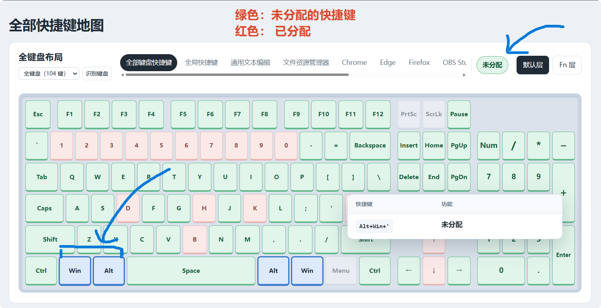
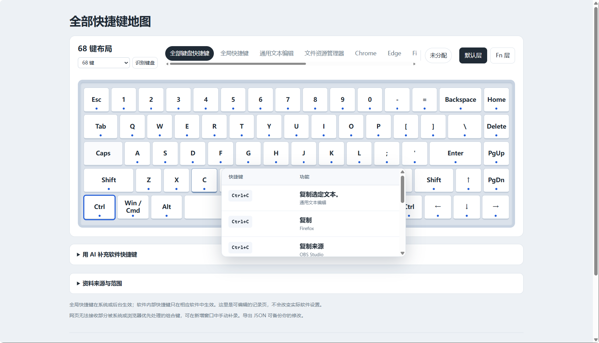

# 快捷键地图 · Shortcut Map

**找出还没分配的快捷键，让每个组合都有安排。**

简体中文 · [English](README.en.md)

想给一个功能设置快捷键，却不知道哪些组合还能用？快捷键地图把 Windows 和软件的快捷键放到一张键盘上，让你查看已有用途、寻找未分配组合，再记录自己的安排。

[下载 Windows 版](https://github.com/Marcell-Lee/shortcut-map-windows/releases/latest) · [反馈问题](https://github.com/Marcell-Lee/shortcut-map-windows/issues)

## 重点功能：查看未分配快捷键

例如，你想找一个 `Alt+Win` 开头的组合：打开“未分配”，选中 `Alt` 和 `Win`，其他按键就会用颜色显示这些组合的分配情况。

- **绿色**：当前资料中未分配，可以考虑用来安排新功能。
- **浅红色**：已有用途，点击就能查看属于哪个软件、用来做什么。
- **蓝色边框**：当前选中的按键。

你可以查看全部快捷键，也可以只看全局快捷键或某个软件。比如，为剪映寻找新组合时，就选择剪映；软件范围内也会考虑已收录的全局快捷键。

这里的“未分配”是根据已收录的资料判断的，**不是对整台电脑的实时占用扫描**。尚未收录的快捷键仍可能占用；补充常用软件的资料后，再到实际软件中确认。

## 查看一个键，能做哪些事

鼠标移到按键上，就能看到相关组合和功能；点击后，可以新增或编辑记录。同一个组合在不同软件里做什么，也能放在一起查看。

## 第一次使用

1. 从发布页下载：文件名带 **Setup** 的是安装版，带 **Portable** 的是免安装版。
2. 打开应用，选择 68 键或 104 键布局。
3. 选择“全部键盘快捷键”“全局快捷键”或一个软件，再打开“未分配”。
4. 点击屏幕上的 `Ctrl`、`Alt`、`Shift`、`Win`，可叠加选择；也可以按住实体键盘上的修饰键。再查看目标按键，就能检查对应组合。

应用用来查看和记录快捷键。要让新组合真正生效，还需要在对应软件或快捷键工具中设置。

## 用 AI 补充你常用的软件

展开 **“用 AI 补充软件快捷键”**，复制提示词，交给能访问本机文件的编程 Agent，例如 Codex、Claude Code、Cursor、GitHub Copilot 或 Gemini CLI。

它会先列出软件让你选择，再查找所选软件当前使用的自定义快捷键；无法确认时，会寻找官方默认资料。Agent 按工作目录里的规范直接更新，保持应用打开即可自动加载，**不用手动复制 JSON**。

普通聊天网页不能直接修改本机文件，需要使用有本机文件权限的 Agent。

## 你的记录，留在你的电脑上

- 修改自动保存在本机；页面底部可以导出、导入备份。
- AI 更新会保留手动记录、未选软件和系统默认资料。
- 启动时不会扫描已安装的软件或读取它们的快捷键配置。
- 支持 68 键和标准 104 键布局；“识别键盘”无法确定型号时，可以手动选择。

从旧 HTML 页面迁移时，先在旧页面导出备份，再在桌面版导入。

## 想参与开发？

构建命令、目录说明和 AI 数据规范放在 [开发文档](docs/DEVELOPMENT.md)。日常使用直接下载 Windows 版即可，不需要安装开发工具。
